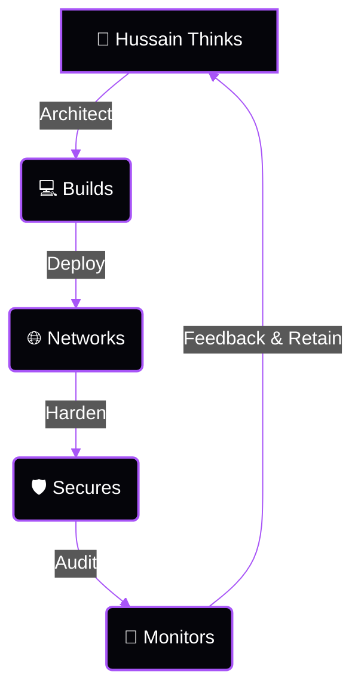

<p align="center">
  
</p>

```
[SYSTEM INITIALIZATION...]
[AUTHENTICATED USER]: En-Hussain
[SECTOR]: Full-Stack & Cyber Defense
[STATUS]: OPERATIONAL // COLD PURPLE TARGET ACTIVE
```

---

### 💻 OPERATOR CAPABILITIES

```yaml
# Core System Engine
technologies:
  Languages:
    - Python      # [===================] 100%
    - C++         # [=================--] 90%
    - JavaScript  # [===================] 100%
    - PHP         # [================---] 85%
  Web Stack:
    - HTML5 / CSS3 (Sleek UI layouts)
    - React (Component architecting)
    - Node.js (High-concurrency servers)
  Infrastructure:
    - Linux / Unix-based distributions (Hardened)
```

---

### 🛡️ SECURE DEFENSE CHANNELS

```python
class SecurityFocus:
    def __init__(self):
        self.offensive = ["Penetration Testing", "Vulnerability Analysis"]
        self.defensive = ["Network Security", "Threat Detection"]
        self.operations = ["Incident Response", "Security Monitoring"]
        
    def get_hacker_mindset(self):
        return "Silent. Smart. Secure."
```

- 🕵️ **Offensive Execution:** Finding hidden weaknesses, testing threat vectors, and engineering exploits.
- 🛡️ **Defensive Hardening:** Constructing impenetrable firewalls, IDS/IPS rules, and real-time SIEM analytics.

---

### 🦉 OPERATION LIFECYCLE FLOW



---

### 📊 METRICS & TELEMETRY

<div align="center">
  <table border="0">
    <tr>
      <td align="center" valign="top">
        
      </td>
      <td align="center" valign="top">
        
      </td>
    </tr>
  </table>
</div>

---

<br />

<div align="center">
  <sub><b>🦉 SILENT. SMART. SECURE.</b></sub>
</div>
