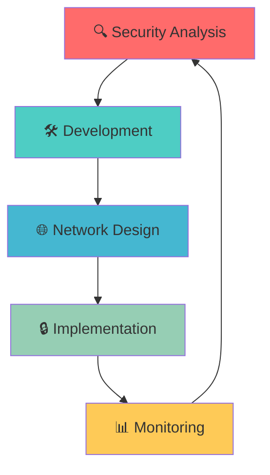

# 👋 Hi, I'm @Eng-Hussain

  

## 🚀 About Me

I'm a passionate **Full-Stack Developer** and **Network & Cybersecurity Engineer** with expertise in building secure, scalable applications and protecting digital infrastructure. I love creating innovative solutions that bridge the gap between development and security.

### 💻 Programming Languages & Technologies

  
| **Backend** | **Frontend** | **Mobile & Desktop** | **Security & Networks** |
|:---:|:---:|:---:|:---:|
|  |  |  |  |
|  |  |  |  |
|  |  |  |  |
|  |  | |  |

## 🛡️ Cybersecurity & Network Engineering

As a **Network & Cybersecurity Engineer**, I specialize in:

- 🔒 **Penetration Testing** & Vulnerability Assessment
- 🌐 **Network Security** Architecture & Implementation
- 🛡️ **Threat Detection** & Incident Response
- 🔐 **Security Auditing** & Compliance
- 🚨 **Honeypot Systems** & Intrusion Detection
- 📊 **Security Analytics** & Risk Management

## 🎯 What I Do

```mermaid
graph TD
    A[🔍 Security Analysis] --> B[🛠️ Development]
    B --> C[🌐 Network Design]
    C --> D[🔒 Implementation]
    D --> E[📊 Monitoring]
    E --> A
    
    style A fill:#ff6b6b
    style B fill:#4ecdc4
    style C fill:#45b7d1
    style D fill:#96ceb4
    style E fill:#feca57
```

## 📊 GitHub Stats

  
  

## 🏆 Achievements & Certifications

- 🥇 **Certified Ethical Hacker (CEH)**
- 🛡️ **CompTIA Security+**
- 🌐 **Cisco CCNA Security**
- 🔒 **Certified Information Security Manager (CISM)**
- 🚀 **AWS Security Specialty**

## 🚀 Current Focus

- 🔐 Building secure web applications with modern frameworks
- 🛡️ Developing advanced threat detection systems
- 🌐 Implementing zero-trust network architectures
- 📱 Creating cross-platform security tools
- 🤖 Exploring AI-powered cybersecurity solutions

## 💡 Fun Facts

- 🎮 I love reverse engineering and CTF competitions
- 🐧 Linux enthusiast and open-source contributor
- ☕ Coffee-powered coding sessions
- 🎯 Always learning new security techniques
- 🌟 Passionate about mentoring new developers

## 🤝 Let's Connect!

  

---

  
  
  **"Security is not a product, but a process."** 🔒
  
  *Building secure digital futures, one line of code at a time.*

